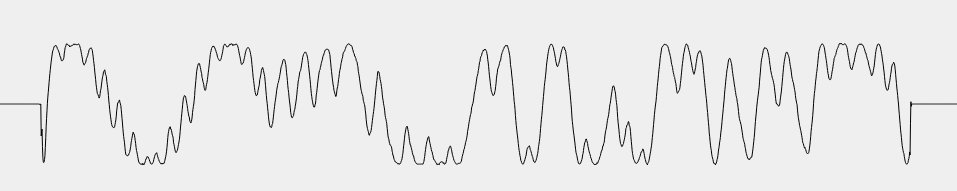
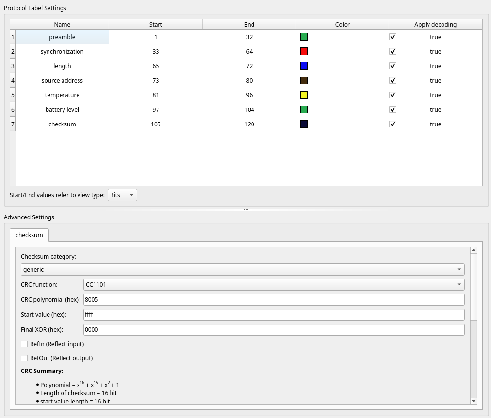
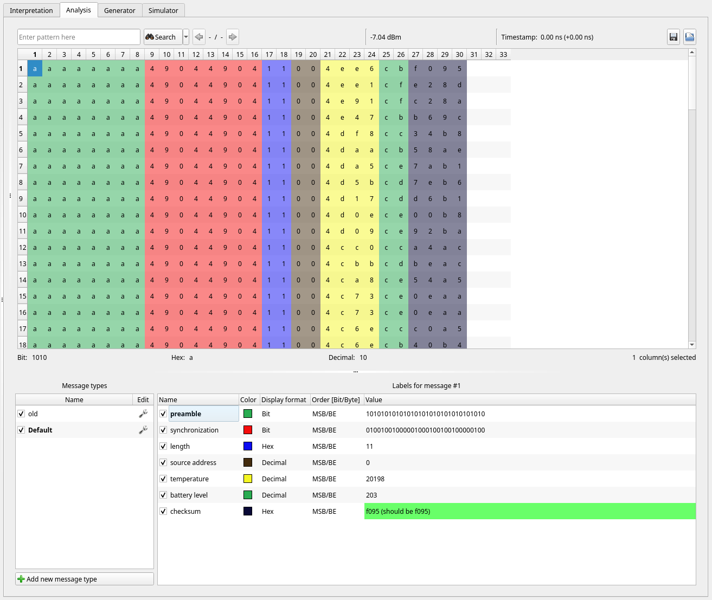

# Rika_E14558

Disclaimer: don't take any of the information below at face value!
I am not an expert on the topic,
and until somebody else can confirm my findings,
there is no guaranty that my analysis is not completely wrong.

If you have any additional information on this topic,
please let me know!

## Introduction

This repository is used to document an attempt at decoding the signal sent by the Rika Wireless Room Sensor E14558.

The initial motivation for this project was a suspected defect in the sensor I received with my stove:
the room temperature displayed seemed to change by increments of 0.5°C,
instead of the 0.1°C documented in the data sheet.

To find out if the issue was coming from the sensor or from the stove itself I decided to check what was sent by the sensor.

While doing initial tests,
moving the sensors to trigger temperature changes,
I quickly noticed something rather strange: <br/>
on the stove, the temperature displayed was incremented or decremented by steps of 0.1°C,
as per the documentation.
But it looked like the changes occurred at regular time intervals (10 or 60 seconds depending on the exact situation),
and that the temperature always ended up stabilizing on specific values, separated by intervals of 0.5°C.

The whole behavior was very suspicious.
Something that was immediately confirmed when I remove the batteries after triggering a temperature change:
on the stove, the temperature displayed continued to increase by steps of 0.1°C... until the stove eventually reported the loss of communication!

In other words: the stove is somehow cheating to simulate 0.1°C steps, when the sensor is in fact most likely sending something completely different...

## Signal details

The sensor is using a TI CC1101 chip,
working on the 868 Mhz band (at least in Europe).
In my case,
the exact frequency is 868.295MHz

I captured the signal with URH using a RTL2832U based SRD.

This is what a typical raw signal looks like:


According to the data sheet,
the CC1101 can do 2-FSK, 4-FSK, GFSK, MSK, OOK and flexible ASK shaping.
I am not expert, so this must be confirmed,
but I suspect that this might be GFSK modulation.

After a few trials and errors, I started to work with the assumption that the signal was 120 bit long,
which gave me good results when demodulating,
and was matching well with the CC1101 data sheet.

Once I figured out that data whitening was used,
I finally managed to get a valid CRC and to deduce the actual format of the packet:
- a 32 bit preamble, made of alternating 1 and 0 (0xAAAAAAAA).
- a 16 bit synchronization sequence (0x4904), repeated twice for a total of 32 bit.
- what should be the data length, on 8 bit (0x11). If we interpret this as 3 bytes, then that's correct but it seems a bit far fetched. In any case, not really relevant for the rest.
- the source address, on 8 bit. In my case 0x00,
but this changes depending on how you setup the switches on the sensor.
- the 3 bytes (24 bit) of data.
- the final 16 bit for the CRC. Polynomial 0x8005 and start value 0xFFFF.

Here is a screenshot of my setup in URH:


Reminder: data whitening must be removed first (the decoding function is provided out of the box in URH).

## Data

### Temperature

Interpreting the data (and even decoding the signal) has been a lot more difficult than for my other temperature sensors:

1. First because Rika didn't use a simple (or commonly used?) encoding such as what I have of most of my other sensors.

2. Then, because my sensor seemed to be defective, and I couldn't measure small temperature changes.

3. But mostly because there was no easy way for me to know what the value for a specific packet *should* be: since the stove is doing some kind of processing on the value sent by the sensor, there was no way for me to be sure that what was displayed on the stove was the actual value sent by the sensor.

So the following must be taken with a pinch of salt:
my level of confidence is very low,
and it would be really nice to have this confirmed by somebody else!

In any case, I have the feeling that the temperature can be obtained from the first 2 bytes of data,
with the following formula:

```
(<decimal value of the first 2 data bytes> - 16384) / 128
```

The result is then rounded to the nearest 0.1°C.

*Important*: in my case, the values don't match exactly with what the stove is displaying => it looks like there a constant offset added to the sensor's value. For me the value was -1.8°C, but since this offset might be added by the stove, it could vary depending on the model, firmware, _etc_.

Note that 16384 in the formula is the 0°C offset. <br/>
If the sensor sends a value lower you get a negative temperature. For example, 16221 would be -1.3°C.

Here are some samples packets capture in URH:


For the one highlighted, the value displayed on my stove would be:
```
(20198 - 16384) / 128 - 1.8 = 28°C
```

That's not my typical room temperature,
just me doing some tests to get good samples!

### Battery level

The last byte of data appears to be the battery level.

With brand new batteries I have seen values in the 220 or 230. With older batteries the values dropped to 110.

I haven't done any extensive testing,
just confirmed that the values are in general reasonably stable for a given pair of batteries. <br/>
The values will vary by a few percents between signals, no more.
But you can clearly see the differences when using different batteries.

Having the battery level in the signal is actually a pretty good news.
The stove itself is not displaying this information,
so you are only notified when batteries are completely dead and communication with the sensor has been lost.
Now we have a way to get some advance warning.


